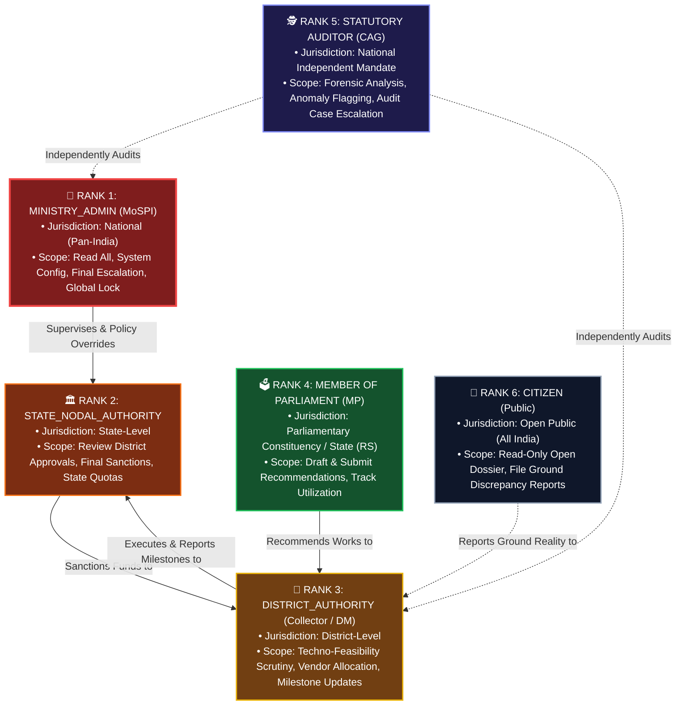
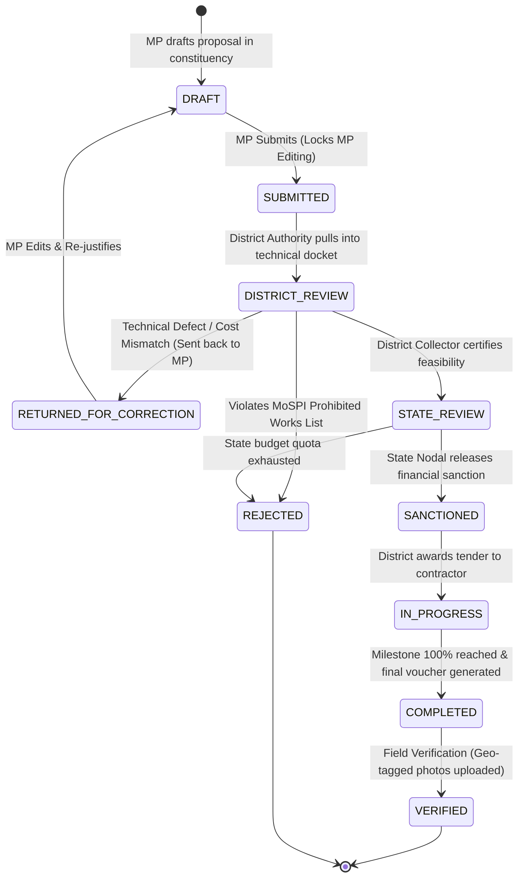
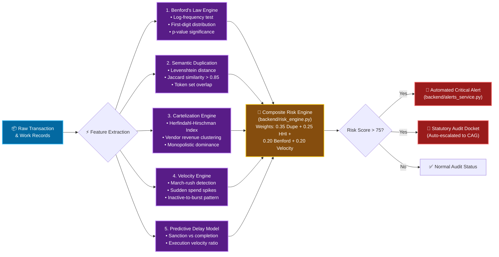
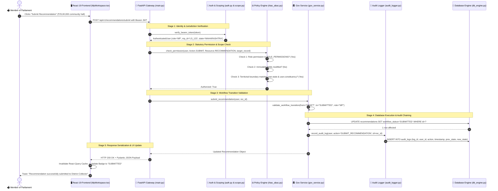

# JanDrishti — Full Code Architecture & Statutory Governance Blueprint
> **SIH26102 — Smart India Hackathon 2026**  
> **Document Purpose:** Complete technical architecture, authority hierarchy, workflow state machines, and code execution flowcharts. Designed for developer reference, architectural auditing, and future customization.

---

## 📑 Table of Contents
1. [Executive Overview & Design Principles](#1-executive-overview--design-principles)
2. [Miro Board 1: Full System Architecture & Data Flow](#2-miro-board-1-full-system-architecture--data-flow)
3. [Miro Board 2: Statutory Authority Hierarchy & RBAC/ABAC](#3-miro-board-2-statutory-authority-hierarchy--rbacabac)
4. [Miro Board 3: Governance & Recommendation Lifecycle State Machine](#4-miro-board-3-governance--recommendation-lifecycle-state-machine)
5. [Miro Board 4: Algorithmic Anomaly Detection & Forensic Audit Pipeline](#5-miro-board-4-algorithmic-anomaly-detection--forensic-audit-pipeline)
6. [Miro Board 5: Full Code Request-Response Execution Trace](#6-miro-board-5-full-code-request-response-execution-trace)
7. [Codebase Directory & Module Responsibility Matrix](#7-codebase-directory--module-responsibility-matrix)
8. [How to Customize & Extend Later](#8-how-to-customize--extend-later)

---

## 1. Executive Overview & Design Principles

**JanDrishti** is an enterprise-grade Parliamentary Intelligence and Statutory Audit Platform designed for the Members of Parliament Local Area Development Scheme (**MPLADS**).

### Core Architectural Pillars
- **Zero-Trust Separation of Powers:** Strict delineation between Political Recommendation (MP), Administrative Feasibility (District Authority), Financial Sanction (State Nodal), and Independent Oversight (CAG/Auditor).
- **Dual-Engine Resilient Database:** Primary cloud database on Supabase PostgreSQL (`dvbqjjwudtbkzjmlcvgo.supabase.co`) with transparent, zero-config failover to local SQLite (`database/mplads.db`).
- **Cryptographic & Chained Audit Trail:** Every workflow transition, financial correction, or statutory status change creates an immutable append-only record in `audit_logs`.
- **Pre-Disbursement Forensic Intelligence:** Algorithms screen projects for duplicate descriptions, vendor cartelization (HHI), Benford's Law distribution deviations, and March-rush spending anomalies before public funds are irreversibly spent.

---

## 2. Miro Board 1: Full System Architecture & Data Flow

```mermaid
flowchart TB
    %% STYLING
    classDef clientStyle fill:#1e293b,stroke:#38bdf8,stroke-width:2px,color:#f8fafc;
    classDef gatewayStyle fill:#0f172a,stroke:#818cf8,stroke-width:2px,color:#f8fafc;
    classDef logicStyle fill:#1e1b4b,stroke:#a855f7,stroke-width:2px,color:#f8fafc;
    classDef dbStyle fill:#064e3b,stroke:#34d399,stroke-width:2px,color:#f8fafc;
    classDef engineStyle fill:#701a75,stroke:#f472b6,stroke-width:2px,color:#f8fafc;

    subgraph CLIENT_TIER ["🖥️ TIER 1: FRONTEND LAYER (React 19 + TypeScript + Vite)"]
        UI_PUBLIC["🌐 Public Citizen Portal<br/>(Overview, MP Explorer, Geo-Maps)"]:::clientStyle
        UI_AUTH["🔐 Role Workspaces<br/>(MP, District, State, Ministry, Auditor)"]:::clientStyle
        UI_ANALYTICS["📊 Intelligence Hub<br/>(Anomalies, Cartels, Benford, Duplicates)"]:::clientStyle
        AXIOS["⚡ Axios HTTP Client<br/>(JWT Bearer Interceptor & Error Boundary)"]:::clientStyle
        
        UI_PUBLIC --> AXIOS
        UI_AUTH --> AXIOS
        UI_ANALYTICS --> AXIOS
    end

    subgraph API_TIER ["🛡️ TIER 2: API GATEWAY & SECURITY (FastAPI + Pydantic v2)"]
        ROUTER["📡 FastAPI Gateway (/api/v1)<br/>backend/main.py"]:::gatewayStyle
        AUTH_MOD["🔑 Auth Engine & JWT Verification<br/>backend/auth.py"]:::gatewayStyle
        RBAC_ABAC["⚖️ RBAC & ABAC Policy Interceptor<br/>backend/rbac_abac.py"]:::gatewayStyle
        SCOPE_MOD["📍 Jurisdiction Scoping Engine<br/>backend/scope.py"]:::gatewayStyle
        
        AXIOS -->|HTTP/REST with JWT| ROUTER
        ROUTER --> AUTH_MOD
        AUTH_MOD --> RBAC_ABAC
        RBAC_ABAC --> SCOPE_MOD
    end

    subgraph LOGIC_TIER ["⚙️ TIER 3: BUSINESS SERVICES & GOVERNANCE ENGINES"]
        GOV_SVC["🏛️ Governance Service<br/>(Workflow, Recommendations, Sanctions)<br/>backend/gov_service.py"]:::logicStyle
        CASE_SVC["📁 Audit Case Manager<br/>(Evidence, Escalations, Status)<br/>backend/cases.py"]:::logicStyle
        ALERT_SVC["🚨 Real-time Alerts Engine<br/>(Critical Triggers, Subscriptions)<br/>backend/alerts_service.py"]:::logicStyle
        AUDIT_LOG["📜 Immutable Audit Logger<br/>backend/audit_logger.py"]:::logicStyle
        
        SCOPE_MOD --> GOV_SVC
        SCOPE_MOD --> CASE_SVC
        SCOPE_MOD --> ALERT_SVC
        GOV_SVC -.-> AUDIT_LOG
        CASE_SVC -.-> AUDIT_LOG
    end

    subgraph FORENSIC_TIER ["🧠 TIER 4: STATISTICAL & FORENSIC INTELLIGENCE"]
        BENFORD["📈 Benford's Law Engine<br/>(First-digit disbursement anomalies)"]:::engineStyle
        DUPE_FINDER["🔍 Semantic Work Matcher<br/>(Levenshtein / Jaccard duplicates)"]:::engineStyle
        CARTEL_DETECTOR["🤝 Vendor HHI & Cartelization<br/>(Market concentration indices)"]:::engineStyle
        VELOCITY_ANOMALY["⚡ Expenditure Velocity Engine<br/>(March-rush & spike detection)"]:::engineStyle
        
        ROUTER --> FORENSIC_TIER
        FORENSIC_TIER --> CASE_SVC
    end

    subgraph DATA_TIER ["💾 TIER 5: PERSISTENCE & STORAGE (Dual Database Engine)"]
        DB_ENGINE["🔀 DB Engine Abstraction<br/>backend/db_engine.py"]:::dbStyle
        SUPABASE[("☁️ Primary: Supabase PostgreSQL<br/>(PostgREST / JSON APIs)")]:::dbStyle
        SQLITE[("💽 Fallback/Local: SQLite 3<br/>database/mplads.db")]:::dbStyle
        
        GOV_SVC --> DB_ENGINE
        CASE_SVC --> DB_ENGINE
        ALERT_SVC --> DB_ENGINE
        DB_ENGINE -->|Online| SUPABASE
        DB_ENGINE -->|Fallback/Dev| SQLITE
    end
```

---

## 3. Miro Board 2: Statutory Authority Hierarchy & RBAC/ABAC

The authority structure models the statutory workflow defined by the **Ministry of Statistics and Programme Implementation (MoSPI)** guidelines.

### Hierarchy Tree



### Statutory Permissions & Boundary Matrix

| Role | Rank | Jurisdiction | Allowed Actions | Restricted Actions | Target Workspace |
| :--- | :---: | :--- | :--- | :--- | :--- |
| **`MINISTRY_ADMIN`** | 1 | **National** (Pan-India) | View, Verify, Audit, Archive, Manage Users, Config | Cannot alter localized ground milestone logs directly | `/workspaces/ministry` |
| **`STATE_NODAL_AUTHORITY`**| 2 | **State** (`user.state`) | Sanction, Approve, Reject, Return to District, View State Dossier | Cannot access or approve projects outside their designated State | `/workspaces/state` |
| **`DISTRICT_AUTHORITY`** | 3 | **District** (`user.district`) | Technical Scrutiny, Milestone Verification, Contractor Assignment | Cannot submit recommendations; cannot approve outside district | `/workspaces/district` |
| **`MP`** | 4 | **Constituency** (`user.mp_id`) | Draft Recommendation, Submit, Track Expenditures, View Ledger | Locked from editing once submitted; cannot access other MPs' dossiers | `/workspaces/mp` |
| **`AUDITOR`** | 5 | **National** (Pan-India) | Create Audit Cases, Flag Transactions, Investigate Duplicates | Read-only to financial ledgers (cannot approve or disburse money) | `/workspaces/auditor` |
| **`CITIZEN`** | 6 | **Public** (Read-Only) | Search MPs, Filter Works, View Anomaly Signals, File Grievances | Zero mutation power on official records; cannot edit works | `/workspaces/citizen` |

### Absolute Financial Immutability (ABAC Policy)
Under `backend/rbac_abac.py`, the following fields **strictly reject any generic HTTP PUT/PATCH updates**:
- `sanctioned_amount` & `expenditure_amount` (Requires Treasury Voucher reconciliation)
- `work_id` & `internal_transaction_id` (Statutory primary keys)
- `internal_mp_id` (Tied directly to ECI Election Gazettes)
- `log_id` (Cryptographically chained audit ledger)

---

## 4. Miro Board 3: Governance & Recommendation Lifecycle State Machine

The state machine in `backend/workflow.py` guarantees that no step can be skipped or executed out of order.



### Transition Authority Table
| From State | To State | Authorized Roles | Condition / Statutory Trigger |
| :--- | :--- | :--- | :--- |
| `DRAFT` | `SUBMITTED` | `MP` | MP confirms title, sector, estimated cost, and justification |
| `SUBMITTED` | `DISTRICT_REVIEW` | `DISTRICT_AUTHORITY`, `MINISTRY_ADMIN` | District Collector accepts proposal for technical scrutiny |
| `DISTRICT_REVIEW` | `RETURNED_FOR_CORRECTION` | `DISTRICT_AUTHORITY`, `MINISTRY_ADMIN` | Cost estimates inaccurate or incomplete documentation |
| `RETURNED_FOR_CORRECTION` | `DRAFT` | `MP` | MP re-opens draft to update figures |
| `DISTRICT_REVIEW` | `STATE_REVIEW` | `DISTRICT_AUTHORITY`, `MINISTRY_ADMIN` | Technical & administrative feasibility approved |
| `STATE_REVIEW` | `SANCTIONED` | `STATE_NODAL_AUTHORITY`, `MINISTRY_ADMIN` | State allocates budget quota; sanction order issued |
| `STATE_REVIEW` | `REJECTED` | `STATE_NODAL_AUTHORITY`, `MINISTRY_ADMIN` | Prohibited work category or fiscal deficit |
| `SANCTIONED` | `IN_PROGRESS` | `DISTRICT_AUTHORITY`, `MINISTRY_ADMIN` | Tender awarded, contractor mobilized on site |
| `IN_PROGRESS` | `COMPLETED` | `DISTRICT_AUTHORITY`, `MINISTRY_ADMIN` | 100% physical milestone & final payment voucher |
| `COMPLETED` | `VERIFIED` | `DISTRICT_AUTHORITY`, `STATE_NODAL_AUTHORITY`, `MINISTRY_ADMIN` | Geo-tagged site photographs uploaded and validated |

---

## 5. Miro Board 4: Algorithmic Anomaly Detection & Forensic Audit Pipeline

Data ingested from official sources runs through **6 specialized forensic engines** in `backend/intelligence.py` and `backend/risk_engine.py` to generate anomaly scores and automated alerts.



---

## 6. Miro Board 5: Full Code Request-Response Execution Trace

Here is the step-by-step trace of how a request moves from user interaction to database persistence and back:



---

## 7. Codebase Directory & Module Responsibility Matrix

| Directory / File | Core Responsibility | Key Functions / Classes |
| :--- | :--- | :--- |
| **`backend/main.py`** | Primary HTTP Router & Endpoint Declarations | 95+ FastAPI route handlers, CORS, Error Handlers |
| **`backend/rbac_abac.py`** | Statutory Security & Access Control | `check_permission()`, `require_permission()`, Role Ranks |
| **`backend/workflow.py`** | State Machine Engine | `validate_workflow_transition()`, Allowed state graphs |
| **`backend/scope.py`** | Geographic SQL Scoping Engine | `jurisdiction_clause()`, `can_edit_record()` |
| **`backend/gov_service.py`** | Statutory Recommendation & Milestone Logic | `create_recommendation()`, `review_recommendation()` |
| **`backend/intelligence.py`** | Statistical Forensics & Analytics Engine | Benford calculation, Duplication index, Cartel HHI |
| **`backend/risk_engine.py`** | Composite Anomaly Scoring | Weighted multi-signal vulnerability calculator |
| **`backend/db_engine.py`** | Dual-Engine Database Abstraction | `PostgresConnection`, `sqlite3` driver switch & compatibility |
| **`backend/cases.py`** | Case Management Service | `create_review_case()`, `update_review_case()` |
| **`backend/alerts_service.py`**| Anomaly Alert Subscriptions & Dispatch | `generate_alerts()`, `update_alert()` |
| **`backend/audit_logger.py`** | Tamper-Proof Audit Logging | `record_audit_log()` with IP, timestamp, user context |
| **`frontend/src/pages/workspaces/`** | Role-Specific User Interfaces | `MpWorkspace`, `DistrictWorkspace`, `StateWorkspace`, `AuditorWorkspace`, `MinistryWorkspace`, `CitizenWorkspace` |
| **`frontend/src/context/AuthContext.tsx`** | Client Session & Token Management | Manages JWT, active role switching, and session storage |

---

## 8. How to Customize & Extend Later

If you wish to modify roles, workflow rules, or anomaly detection logic later, here are the exact files to edit:

### 1. Adding or Modifying a Role
1. Open `backend/rbac_abac.py`:
   - Add new role constant (e.g., `ROLE_PANCHAYAT_SECRETARY = "PANCHAYAT_SECRETARY"`).
   - Add rank to `ROLE_HIERARCHY_RANK`.
   - Define permissions inside `ROLE_PERMISSIONS`.
2. Open `backend/auth.py`:
   - Add demo credentials if testing via login.
3. Open `frontend/src/pages/workspaces/`:
   - Add a new workspace component and register route in `frontend/src/App.tsx`.

### 2. Modifying Workflow State Transitions
- Open `backend/workflow.py`:
  - Edit `RECOMMENDATION_TRANSITIONS` dictionary to add or remove allowed next states.
  - Edit `TRANSITION_AUTHORITY` tuple map to define which roles are permitted to trigger the transition.

### 3. Adjusting Anomaly & Forensic Risk Weights
- Open `backend/risk_engine.py`:
  - Adjust default weights:
    ```python
    DEFAULT_WEIGHTS = {
        "duplicate_work": 0.35,
        "vendor_concentration": 0.25,
        "benford_deviation": 0.20,
        "velocity_spike": 0.20
    }
    ```
  - Or use the API endpoint `PUT /api/v1/risk-weights` dynamically.
