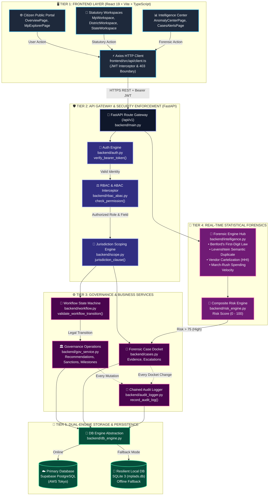
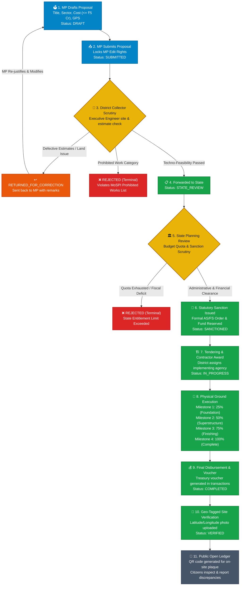
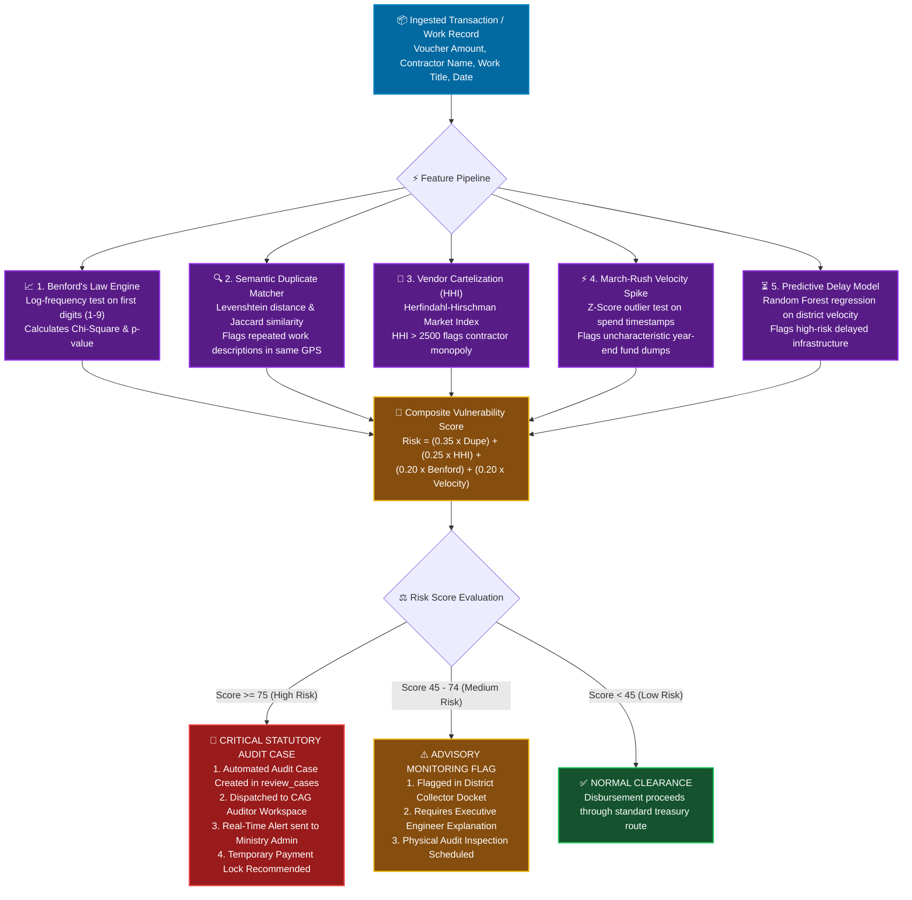

# JanDrishti — Architecture & Step-by-Step Flowchart Blueprint
> **SIH26102 — Smart India Hackathon 2026**  
> **Theme:** Smart Governance, Citizen Empowerment & Public Financial Accountability  
> **Classification:** Official Technical Architecture, Statutory State Machine & Forensic Audit Guide

---

## 📑 Table of Contents
1. [Flowchart 1: Full System Architecture & Data Flow](#flowchart-1-full-system-architecture--data-flow)
2. [Flowchart 2: End-to-End Governance & Recommendation Lifecycle](#flowchart-2-end-to-end-governance--recommendation-lifecycle)
3. [Flowchart 3: Pre-Disbursement Forensic Intelligence & Fraud Detection](#flowchart-3-pre-disbursement-forensic-intelligence--fraud-detection)
4. [Flowchart 4: Full Code Request-Response Lifecycle](#flowchart-4-full-code-request-response-lifecycle)
5. [Statutory Authority Matrix & Separation of Powers](#statutory-authority-matrix--separation-of-powers)
6. [Codebase Directory & Module Responsibility Matrix](#codebase-directory--module-responsibility-matrix)
7. [How to Customize or Extend Later](#how-to-customize-or-extend-later)

---

## Flowchart 1: Full System Architecture & Data Flow
This diagram illustrates how data flows across all 5 tiers of JanDrishti, from client interaction to dual-database persistence.



### Step-by-Step Data Flow Breakdown
| Stage | Component & File | What Actually Happens (Core Logic) | Destination | Output / Guarantee |
| :--- | :--- | :--- | :--- | :--- |
| **1. Client** | `frontend/src/api/client.ts` | User triggers action in UI. Axios intercepts request, attaches `Authorization: Bearer <JWT>`, and dispatches JSON payload. | FastAPI Gateway | Signed HTTP Request |
| **2. Auth** | `backend/auth.py` | Decodes JWT using HMAC-SHA256. Resolves user identity, active statutory role, state, and parliamentary constituency. | `AuthenticatedUser` | Session Authenticated |
| **3. Security** | `backend/rbac_abac.py` | **Dual Validation:**<br/>1. RBAC: Checks if role has permission on resource.<br/>2. ABAC: Enforces territorial boundary and verifies no immutable fields (e.g. expenditure) are touched. | State Machine / Service | HTTP 403 if out of jurisdiction |
| **4. Scope** | `backend/scope.py` | Generates parameterized SQL WHERE fragments restricting rows to the official's mandate (e.g. `state_normalized = ?`). | Database Query | Strict Data Isolation |
| **5. Logic** | `backend/gov_service.py` | Executes statutory business logic (e.g., sanction order issuance, milestone tracking) and triggers tamper-proof audit logging. | `backend/db_engine.py` | Atomic DB Transaction |
| **6. Persist** | `backend/db_engine.py` | Attempts commit to Cloud PostgreSQL. If network fails, automatically falls back to local SQLite with zero downtime. | PostgreSQL / SQLite | Data Persisted & Logged |

---

## Flowchart 2: End-to-End Governance & Recommendation Lifecycle
Detailed statutory workflow from the moment an MP drafts a proposal to physical verification on the ground.



### Complete Governance Lifecycle Table
| Step | Actor & Role | What Actually Happens (Action & Business Rule) | Database Table & Mutation | Resulting Status |
| :--- | :--- | :--- | :--- | :--- |
| **01** | Member of Parliament | MP inputs proposal in `MpWorkspace.tsx`. Validates cost against annual entitlement (₹5 Crore). Stored as draft. | `INSERT INTO recommendations` (id: `REC-...`) | `DRAFT` |
| **02** | Member of Parliament | MP clicks "Submit". **Statutory edit lock is applied**; MP can no longer alter estimated cost or sector. Sent to District Authority. | `UPDATE recommendations SET workflow_status='SUBMITTED'` | `SUBMITTED` |
| **03** | District Authority (DM) | District Collector & Executive Engineer perform techno-economic survey, verify land availability, and check estimates against Schedule of Rates. | `UPDATE recommendations SET district_authority_remarks=?` | `DISTRICT_REVIEW` |
| **03a** | District Authority | **Defect Branch:** If estimates are inflated or land is disputed, work is returned to MP with remarks. Edit lock temporarily lifted. | `UPDATE recommendations SET workflow_status='RETURNED_FOR_CORRECTION'` | `RETURNED_FOR_CORRECTION` |
| **04** | District Authority | Technical feasibility certified. Docket dispatched electronically to State Planning Department for formal financial sanction. | `UPDATE recommendations SET workflow_status='STATE_REVIEW'` | `STATE_REVIEW` |
| **05** | State Nodal Authority | State verifies state allocation quota. Issues statutory **Administrative Sanction & Financial Sanction (AS/FS)**. Funds earmarked. | `UPDATE recommendations SET workflow_status='SANCTIONED'`<br/>`INSERT INTO works (sanctioned_amount)` | `SANCTIONED` |
| **06** | District Authority | Tender published, implementing agency selected (PWD, Zilla Parishad). Work order issued and mobilization begins on site. | `UPDATE works SET lifecycle_status='IN_PROGRESS', work_contractor=?` | `IN_PROGRESS` |
| **07** | District Authority | Field engineers record milestone completions (25%, 50%, 75%, 100%). Final measurement book (MB) signed and approved. | `UPDATE works SET progress_percentage=100` | `IN_PROGRESS` |
| **08** | District Authority | Final payment disbursement released. Official Treasury Voucher generated with timestamp and bank reference. **Figures locked.** | `INSERT INTO transactions (voucher_no, amount, transaction_type='FINAL_PAYMENT')` | `COMPLETED` |
| **09** | District / State / Min | Geo-tagged photos of the finished physical asset uploaded with tamper-proof coordinates. Asset plaque registered. | `UPDATE works SET has_images=1, lifecycle_status='VERIFIED'` | `VERIFIED` |
| **10** | General Citizen | Asset published to public map. Citizens scan plaque QR code, inspect ground reality, and can submit photo-backed discrepancy reports. | `INSERT INTO citizen_reports (report_id, work_id, discrepancy_type)` | `PUBLIC_AUDIT` |

---

## Flowchart 3: Pre-Disbursement Forensic Intelligence & Fraud Detection
How automated algorithms inspect every voucher and project before money is disbursed.



### Forensic Engines Specification
| Forensic Engine | Mathematical Formula | What Actually Happens (Inspection Logic) | Weight | Action Taken |
| :--- | :--- | :--- | :--- | :--- |
| **1. Semantic Duplication** | `Jaccard(A, B) > 0.85`<br/>`Levenshtein(Title) < 3` | Scans all past works in the same Gram Panchayat. If a project description matches an existing asset, it flags potential double-invoicing. | **35%** | Immediate Sanction Hold |
| **2. Vendor Cartel (HHI)** | `HHI = Σ (Market Share_i)²`<br/>`Threshold: > 2500` | Calculates vendor revenue share within each constituency. If 1 or 2 contractors win over 60% of tenders, flags collusive bidding. | **25%** | Vigilance Inquiry |
| **3. Benford's Law** | `P(d) = log10(1 + 1/d)`<br/>`Chi-Square p < 0.05` | Evaluates the natural logarithmic frequency of leading digits. Fabricated invoices cluster unnaturally around 4, 7, or 9, failing Benford tests. | **20%** | Forensic Audit Flag |
| **4. Expenditure Velocity** | `Z = (Spend - μ) / σ`<br/>`Z-Score > 3.0` | Compares spending rate in March vs monthly average. Disproportionate spikes ("March Rush") indicate fund dumping without physical progress. | **20%** | Audit Case Queued |
| **5. Predictive Delay** | `RandomForestRegressor()`<br/>Execution Velocity Ratio | Predicts expected completion date based on terrain, sector, and district track record. Detects stalled projects before public outcry. | Auxiliary | Milestone Warning |

---

## Flowchart 4: Full Code Request-Response Lifecycle
Front-to-back trace of a request from UI click to DB commit.

```mermaid
sequenceDiagram
    autonumber
    actor ACTOR as 👤 Statutory Official (e.g. MP or DM)
    participant UI as 🖥️ React 19 Frontend (Workspace Component)
    participant CLIENT as ⚡ Axios Client (frontend/src/api/client.ts)
    participant GATEWAY as 📡 FastAPI Gateway (backend/main.py)
    participant AUTH as 🔑 Auth Engine (backend/auth.py)
    participant RBAC as ⚖️ Policy Interceptor (backend/rbac_abac.py)
    participant STATE as 🔄 State Machine (backend/workflow.py)
    participant GOV as 🏛️ Gov Service (backend/gov_service.py)
    participant AUDIT as 📜 Audit Logger (backend/audit_logger.py)
    participant DB as 💾 DB Engine (backend/db_engine.py)

    ACTOR->>UI: Clicks statutory action (e.g., "Submit Recommendation")
    UI->>CLIENT: Calls api.post("/recommendations/submit", {rec_id: "REC-123"})
    
    CLIENT->>CLIENT: Injects Bearer JWT token from localStorage
    CLIENT->>GATEWAY: POST /api/v1/recommendations/submit (HTTP 1.1)

    Note over GATEWAY,AUTH: Step 1: Authentication & Identity Unpacking
    GATEWAY->>AUTH: verify_bearer_token(credentials)
    AUTH->>AUTH: Decodes HMAC-SHA256 JWT; extracts role='MP', state='MAHARASHTRA'
    AUTH-->>GATEWAY: Returns AuthenticatedUser instance

    Note over GATEWAY,RBAC: Step 2: RBAC & ABAC Boundary Enforcement
    GATEWAY->>RBAC: check_permission(user, Action.SUBMIT, Resource.RECOMMENDATION, target_record)
    RBAC->>RBAC: 1. RBAC check: Does MP have SUBMIT on RECOMMENDATION? (YES)<br/>2. ABAC check: Is user.state == target_record.state? (YES)<br/>3. Immutability check: Are financial figures being edited? (NO)
    RBAC-->>GATEWAY: Authorized = True

    Note over GATEWAY,STATE: Step 3: Statutory Workflow State Validation
    GATEWAY->>STATE: validate_workflow_transition(current="DRAFT", target="SUBMITTED", role="MP")
    STATE->>STATE: Checks RECOMMENDATION_TRANSITIONS & TRANSITION_AUTHORITY
    STATE-->>GATEWAY: Valid Transition = True

    Note over GATEWAY,GOV: Step 4: Business Logic & DB Mutation
    GATEWAY->>GOV: submit_recommendation(user, rec_id)
    GOV->>DB: UPDATE recommendations SET workflow_status='SUBMITTED' WHERE id=?
    DB->>DB: Parameterized SQL executed against Supabase PostgreSQL
    DB-->>GOV: Row affected count = 1

    Note over GOV,AUDIT: Step 5: Cryptographic Chained Audit Logging
    GOV->>AUDIT: record_audit_log(user, action='SUBMIT_REC', prev='DRAFT', new='SUBMITTED')
    AUDIT->>DB: INSERT INTO audit_logs (log_id, user_id, action, timestamp, client_ip)
    DB-->>AUDIT: Audit log committed

    Note over GATEWAY,UI: Step 6: Response Serialization & UI Update
    GOV-->>GATEWAY: Updated recommendation dictionary
    GATEWAY-->>CLIENT: HTTP 200 OK + Pydantic v2 JSON Schema
    CLIENT-->>UI: Resolves Promise
    UI->>UI: Invalidates React Query cache -> updates status badge to "SUBMITTED"
    UI-->>ACTOR: Renders green success toast: "Submitted to District Collector"
```

---

## Statutory Authority Matrix & Separation of Powers

| Role & Rank | Jurisdiction Scope | Statutory Powers (What they CAN do) | Strict Restrictions (What they CANNOT do) |
| :--- | :--- | :--- | :--- |
| **RANK 1<br/>MINISTRY_ADMIN** | Pan-India<br/>(National Corpus) | View all 36 States, configure system risk weights, approve central dockets, manage system users, global audit review. | Cannot alter ground physical milestone records; cannot bypass district techno-scrutiny. |
| **RANK 2<br/>STATE_NODAL** | Designated State<br/>(`user.state`) | Review district dockets, grant statutory Financial Sanction (AS/FS), reject non-compliant works, monitor state budget quotas. | Cannot access, approve, or modify records of any other Indian State. |
| **RANK 3<br/>DISTRICT_AUTHORITY** | Designated District<br/>(`user.district`) | Techno-economic scrutiny, tender floating, contractor assignment, milestone updates, geo-tagged photo uploads, release final payment. | Cannot create work recommendations; cannot sanction outside district; cannot modify treasury transaction values directly. |
| **RANK 4<br/>MEMBER OF PARLIAMENT** | Parliamentary Seat<br/>(`user.mp_id`) | Draft and submit work recommendations within ₹5 Crore entitlement; track execution velocity; view constituency ledger. | Locked from editing after submission; cannot approve works; cannot access other MPs' dockets. |
| **RANK 5<br/>STATUTORY AUDITOR** | National Mandate<br/>(CAG / Independent) | Inspect Benford flags, cartel HHI scores, duplicate work dockets; create forensic audit cases; flag transactions for recovery. | Read-only to financial ledgers; cannot disburse, approve, or alter financial figures. |
| **RANK 6<br/>GENERAL CITIZEN** | Open Public<br/>(National Read-Only) | Inspect all works on interactive maps; search MP utilization; scan QR code plaques on physical assets; submit ground discrepancy feedback. | Zero mutation power on official records; cannot edit or sanction works. |

---

## Codebase Directory & Module Responsibility Matrix

| Directory / File | Core Responsibility | Key Functions / Classes |
| :--- | :--- | :--- |
| **`backend/main.py`** | Primary HTTP Router & Endpoint Declarations | 95+ FastAPI route handlers, CORS, Error Handlers |
| **`backend/rbac_abac.py`** | Statutory Security & Access Control | `check_permission()`, `require_permission()`, Role Ranks |
| **`backend/workflow.py`** | State Machine Engine | `validate_workflow_transition()`, Allowed state graphs |
| **`backend/scope.py`** | Geographic SQL Scoping Engine | `jurisdiction_clause()`, `can_edit_record()` |
| **`backend/gov_service.py`** | Statutory Recommendation & Milestone Logic | `create_recommendation()`, `review_recommendation()` |
| **`backend/intelligence.py`** | Statistical Forensics & Analytics Engine | Benford calculation, Duplication index, Cartel HHI |
| **`backend/risk_engine.py`** | Composite Anomaly Scoring | Weighted multi-signal vulnerability calculator |
| **`backend/db_engine.py`** | Dual-Engine Database Abstraction | `PostgresConnection`, `sqlite3` driver switch & compatibility |
| **`backend/cases.py`** | Case Management Service | `create_review_case()`, `update_review_case()` |
| **`backend/alerts_service.py`**| Anomaly Alert Subscriptions & Dispatch | `generate_alerts()`, `update_alert()` |
| **`backend/audit_logger.py`** | Tamper-Proof Audit Logging | `record_audit_log()` with IP, timestamp, user context |
| **`frontend/src/pages/workspaces/`** | Role-Specific User Interfaces | `MpWorkspace`, `DistrictWorkspace`, `StateWorkspace`, `AuditorWorkspace`, `MinistryWorkspace`, `CitizenWorkspace` |
| **`frontend/src/context/AuthContext.tsx`** | Client Session & Token Management | Manages JWT, active role switching, and session storage |

---

## How to Customize or Extend Later

1. **Adding a New Role:**
   - Open `backend/rbac_abac.py`: define role constant, add rank to `ROLE_HIERARCHY_RANK`, and declare permission sets in `ROLE_PERMISSIONS`.
   - Open `frontend/src/pages/workspaces/`: create a new workspace component and register route in `frontend/src/App.tsx`.

2. **Modifying Workflow States:**
   - Open `backend/workflow.py`: edit `RECOMMENDATION_TRANSITIONS` dictionary to add or modify permitted next states.
   - Map authorized roles in `TRANSITION_AUTHORITY`.

3. **Adjusting Forensic Risk Weights:**
   - Open `backend/risk_engine.py`: update `DEFAULT_WEIGHTS`.
   - Or dynamically call `PUT /api/v1/risk-weights` via REST API without restarting the backend.
