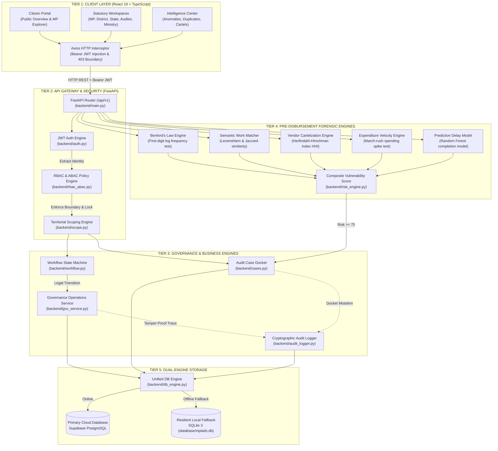
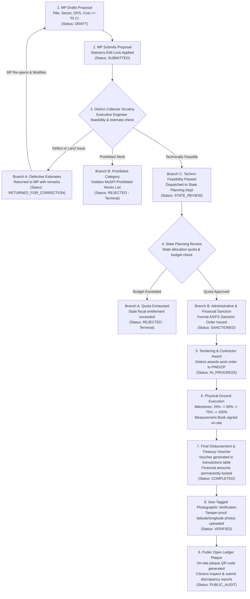

# JanDrishti — Miro Ready Copy-Paste Flowcharts
> **How to use in Miro:**
> 1. Open your Miro board.
> 2. In the left toolbar, click **More apps (+)** and search for **Mermaid** (or open the Mermaid app).
> 3. Copy any block below, paste it into the code editor, and click **Create diagram**.
> 4. Miro will automatically lay out all shapes, connectors, colors, and labels!

---

## 📋 FLOWCHART 1: Full System 5-Tier Architecture & Data Flow



---

## 📋 FLOWCHART 2: Statutory Governance & Recommendation Lifecycle (MP to Citizen)



---

## 📋 FLOWCHART 3: Pre-Disbursement Forensic Intelligence & Anti-Fraud Engine

```mermaid
flowchart TD
    IN["Ingested Transaction / Work Record\nVoucher Amount, Contractor Name, Work Title, Date"]
    
    IN --> SPLIT{"Parallel Feature Extraction"}

    %% 5 ENGINES
    SPLIT --> E1["1. Benford's Law Engine\nFormula: P(d) = log10(1 + 1/d)\nFlags unnatural voucher leading digits\nWeight: 20%"]
    SPLIT --> E2["2. Semantic Duplicate Matcher\nFormula: Jaccard > 0.85 & Levenshtein < 3\nFlags duplicate work funded in same area\nWeight: 35%"]
    SPLIT --> E3["3. Vendor Cartelization (HHI)\nFormula: HHI = SUM(Market Share)^2\nHHI > 2500 flags contractor monopoly\nWeight: 25%"]
    SPLIT --> E4["4. Expenditure Velocity Engine\nFormula: Z = (Spend - Mean) / StdDev\nZ-Score > 3.0 flags March fund dumps\nWeight: 20%"]
    SPLIT --> E5["5. Predictive Delay Model\nRandom Forest model on district performance\nFlags stalled/delayed infrastructure"]

    %% COMPOSITE RISK
    E1 --> COMP["Composite Risk Calculator\nRisk Score = (0.35 x Dupe) + (0.25 x HHI) +\n(0.20 x Benford) + (0.20 x Velocity)"]
    E2 --> COMP
    E3 --> COMP
    E4 --> COMP
    E5 --> COMP

    %% DECISION
    COMP --> THRESHOLD{"Evaluate Risk Score"}

    THRESHOLD -->|Score >= 75 (High Risk)| CRIT["CRITICAL AUDIT DOCKET\n1. Auto-create case in review_cases\n2. Escalate to CAG Auditor Workspace\n3. Real-time alert to Ministry Admin\n4. Recommended payment freeze"]
    THRESHOLD -->|Score 45 - 74 (Medium Risk)| MED["ADVISORY WARNING\n1. Flagged on District Collector dashboard\n2. Executive Engineer justification required\n3. Field inspection queued"]
    THRESHOLD -->|Score < 45 (Low Risk)| LOW["NORMAL CLEARANCE\nDisbursement cleared for payment"]
```

---

## 📋 FLOWCHART 4: Full Code Request-Response Lifecycle (Front-to-Back)

```mermaid
sequenceDiagram
    autonumber
    actor ACTOR as Statutory Official (MP or DM)
    participant UI as React 19 Frontend (Workspace)
    participant CLIENT as Axios Client (api/client.ts)
    participant GATEWAY as FastAPI Gateway (backend/main.py)
    participant AUTH as Auth Engine (backend/auth.py)
    participant RBAC as Policy Interceptor (backend/rbac_abac.py)
    participant STATE as State Machine (backend/workflow.py)
    participant GOV as Governance Service (backend/gov_service.py)
    participant AUDIT as Audit Logger (backend/audit_logger.py)
    participant DB as Dual DB Engine (backend/db_engine.py)

    ACTOR->>UI: Clicks statutory button (e.g. Submit Recommendation)
    UI->>CLIENT: Calls api.post('/recommendations/submit', payload)
    CLIENT->>CLIENT: Injects Bearer JWT from localStorage
    CLIENT->>GATEWAY: POST /api/v1/recommendations/submit

    Note over GATEWAY,AUTH: Step 1: Authentication & Identity Unpacking
    GATEWAY->>AUTH: verify_bearer_token(credentials)
    AUTH-->>GATEWAY: AuthenticatedUser (role='MP', state='MAHARASHTRA')

    Note over GATEWAY,RBAC: Step 2: RBAC & ABAC Boundary Enforcement
    GATEWAY->>RBAC: check_permission(user, Action.SUBMIT, Resource.RECOMMENDATION)
    RBAC->>RBAC: 1. Role permission valid? (YES)<br/>2. Territorial boundary matches? (YES)<br/>3. Financial immutability respected? (YES)
    RBAC-->>GATEWAY: Authorized = True

    Note over GATEWAY,STATE: Step 3: Statutory State Machine Check
    GATEWAY->>STATE: validate_workflow_transition(from='DRAFT', to='SUBMITTED', role='MP')
    STATE-->>GATEWAY: Valid Transition = True

    Note over GATEWAY,GOV: Step 4: Business Logic & DB Mutation
    GATEWAY->>GOV: submit_recommendation(user, rec_id)
    GOV->>DB: UPDATE recommendations SET workflow_status='SUBMITTED' WHERE id=?
    DB-->>GOV: Row affected = 1

    Note over GOV,AUDIT: Step 5: Cryptographic Chained Audit Logging
    GOV->>AUDIT: record_audit_log(user, action='SUBMIT_REC', prev='DRAFT', new='SUBMITTED')
    AUDIT->>DB: INSERT INTO audit_logs (log_id, user_id, action, timestamp, client_ip)
    DB-->>AUDIT: Audit log committed

    Note over GATEWAY,UI: Step 6: Response Serialization & UI Update
    GOV-->>GATEWAY: Updated recommendation dictionary
    GATEWAY-->>CLIENT: HTTP 200 OK + Pydantic v2 JSON Schema
    CLIENT-->>UI: Resolves Promise
    UI->>UI: Invalidates React Query cache -> updates badge to SUBMITTED
    UI-->>ACTOR: Renders green success notification toast
```
