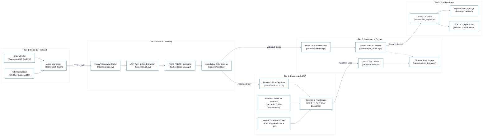
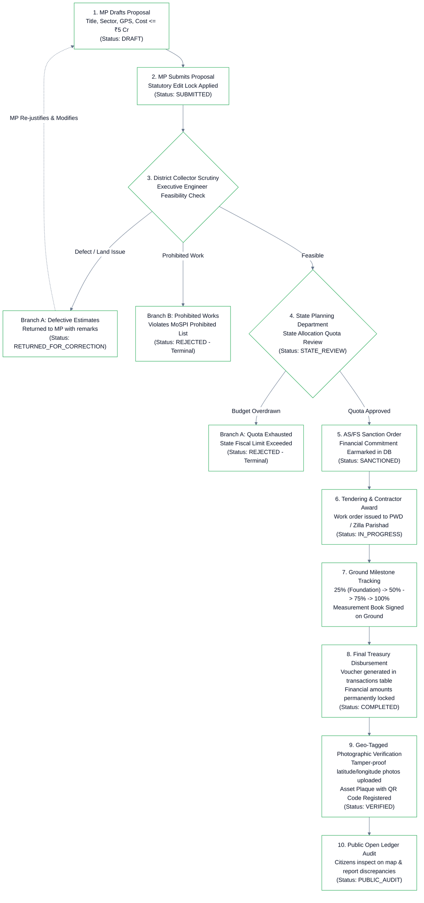
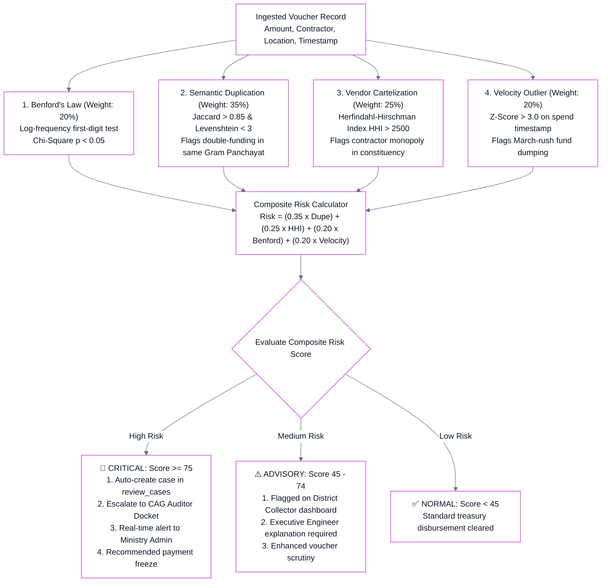

# JanDrishti — White Theme Miro Copy-Paste Flowcharts & SVG Files

> **Option 1 (Recommended - 100% Beautiful in Miro):**  
> Simply **drag and drop** the `.svg` files directly from your file explorer onto your Miro canvas! They render with crisp vectors, pure white backgrounds, clean colors, and **zero overlapping lines**:
> - 📄 [`Miro_Flowchart_1_Architecture.svg`](file:///d:/SIH26102/Miro_Flowchart_1_Architecture.svg)
> - 📄 [`Miro_Flowchart_2_Governance_Lifecycle.svg`](file:///d:/SIH26102/Miro_Flowchart_2_Governance_Lifecycle.svg)
> - 📄 [`Miro_Flowchart_3_Forensic_Pipeline.svg`](file:///d:/SIH26102/Miro_Flowchart_3_Forensic_Pipeline.svg)
>
> **Option 2 (Mermaid Copy-Paste into Miro):**  
> In Miro, open the **Mermaid tool** (Toolbar &rarr; `+` More tools &rarr; Mermaid), paste any code block below, and click **Create diagram**. These blocks are formatted in **pure White Theme** with **zero overlapping lines**.

---

## 📋 FLOWCHART 1: Full System 5-Tier Architecture (White Theme)

---

## 📋 FLOWCHART 2: Statutory Governance Lifecycle (White Theme - Linear Pipeline)

---

## 📋 FLOWCHART 3: Pre-Disbursement Forensic Intelligence Pipeline (White Theme)

