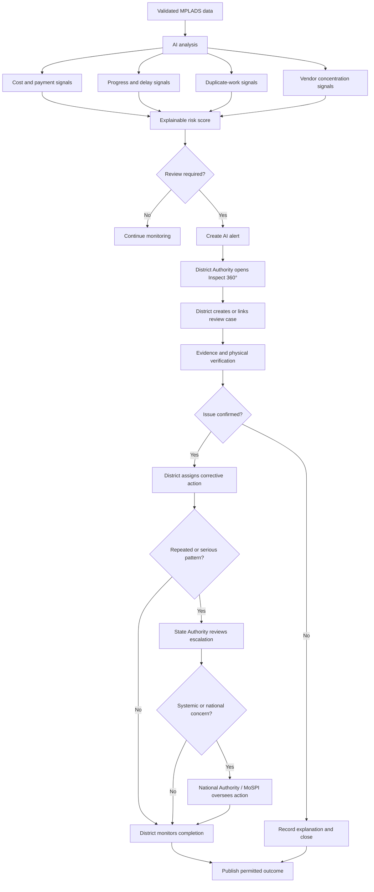
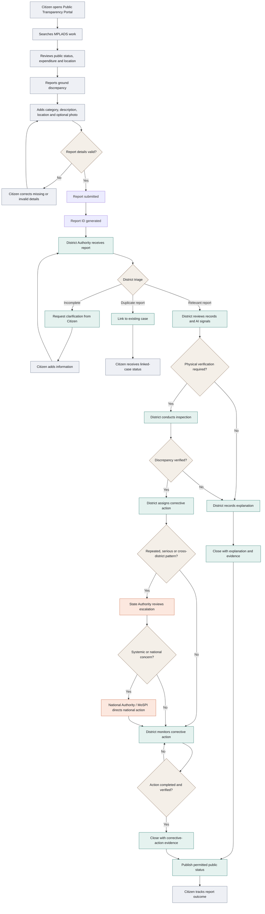
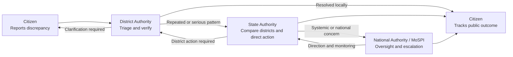
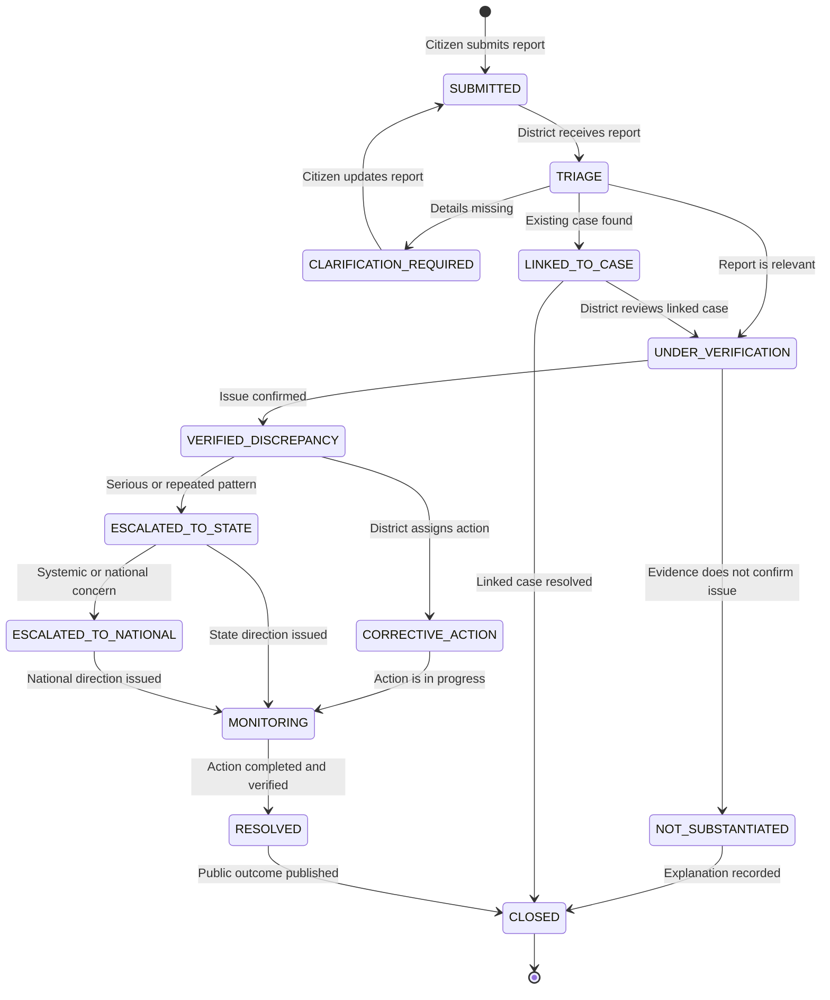
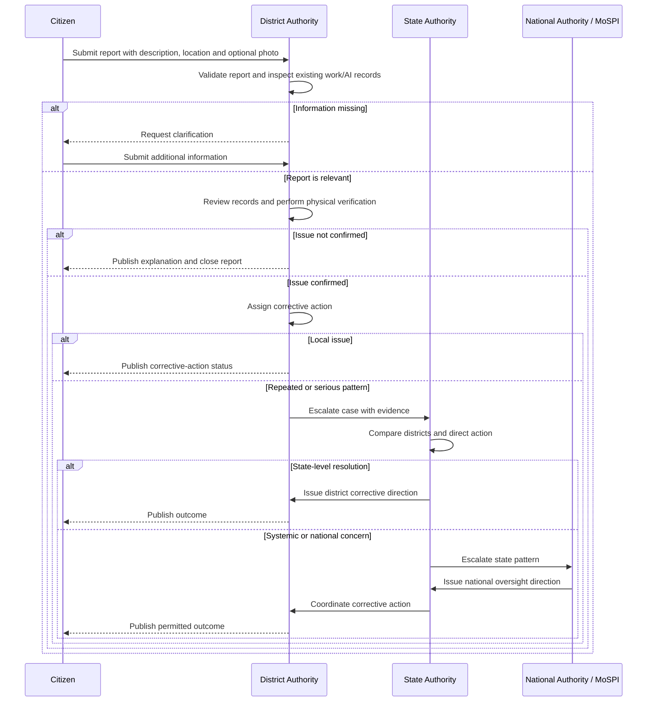

# JanDrishti SIH26102 Working Scenario

## Scenario: Citizen reports a suspected MPLADS irregularity

This scenario uses only four operational roles:

1. **Citizen**
2. **District Authority**
3. **State Authority**
4. **National Authority / MoSPI**

The scenario demonstrates how a citizen report becomes a verified, escalated and publicly tracked administrative action.

---

## AI anomaly scenario

### Example

JanDrishti detects a Pune library work with:

- High expenditure but low physical progress
- Execution duration above the category benchmark
- A nearby work with a similar description
- Elevated vendor concentration

The AI combines these signals into a prioritisation alert:

```text
Risk score: 78/100
Severity: HIGH
Result: Potential anomaly — human review required
```

This is a review signal, not a confirmed fraud finding.

### AI anomaly flowchart



### AI anomaly role hand-off

```text
AI detects and explains
    ↓
District Authority investigates
    ↓
State Authority coordinates repeated or serious cases
    ↓
National Authority / MoSPI oversees systemic issues
    ↓
District completes corrective action
    ↓
Public outcome is published
```

---

## Role 1: Citizen

### Citizen sees

- Public work description
- Work location
- Sanctioned and reported expenditure
- Completion status
- Public case/report status

### Citizen action

1. Opens the Public Transparency Portal.
2. Searches for an MPLADS work.
3. Observes a possible discrepancy:
   - Work does not exist at the displayed location.
   - Work is abandoned or delayed.
   - Physical quality does not match the displayed status.
   - Public expenditure appears inconsistent with visible progress.
4. Selects **Report Ground Discrepancy**.
5. Chooses a report category.
6. Adds description, location and optional photograph.
7. Submits the report.

### System response

- Generates a report ID.
- Stores the timestamp and work reference.
- Sets status to `SUBMITTED`.
- Sends the report to the District Authority queue.

---

## Role 2: District Authority

### District Authority sees

- Citizen report
- Work record and source provenance
- Existing AI anomaly signals
- Related alerts and review cases
- Submitted description, location and photograph

### District Authority action

1. Performs initial triage.
2. Checks whether the report is complete.
3. Links it to an existing AI alert or creates a review case.
4. Requests clarification if information is insufficient.
5. Reviews sanctions, payments, progress and completion records.
6. Requests supporting records from the responsible implementing office.
7. Dispatches physical verification when required.
8. Records the inspection result.
9. Assigns corrective action if an issue is confirmed.
10. Closes the report with evidence or escalates it to State Authority.

### Possible decisions

```text
NOT_SUBSTANTIATED
NEEDS_CLARIFICATION
VERIFIED_DISCREPANCY
CORRECTIVE_ACTION
ESCALATED_TO_STATE
RESOLVED
```

---

## Role 3: State Authority

### State Authority sees

- State-wide citizen reports
- District review cases
- Repeated anomaly categories
- Common work, vendor or agency patterns
- Overdue unresolved cases

### State Authority action

1. Reviews cases escalated by districts.
2. Compares the issue across districts.
3. Checks whether the same pattern is repeated.
4. Directs additional district verification.
5. Coordinates a state-level review when needed.
6. Monitors corrective-action deadlines.
7. Closes state-level escalation when resolved.
8. Escalates systemic or serious cases to National Authority / MoSPI.

### Escalation triggers

- Same pattern in multiple districts.
- Repeated complaints about the same work or agency.
- High-value financial exposure.
- District action overdue.
- Possible systemic implementation weakness.

---

## Role 4: National Authority / MoSPI

### National Authority sees

- National and state-level report trends
- Serious escalations
- District and state resolution performance
- Cross-state anomaly patterns
- Source health and data freshness

### National Authority action

1. Reviews systemic or high-severity escalations.
2. Compares states and districts.
3. Issues monitoring directions or advisories.
4. Selects cases for national review or audit.
5. Directs State Authority to complete corrective action.
6. Refers matters to the competent audit or investigation authority when required.
7. Tracks closure and publishes permitted public outcomes.

---

## Citizen report flowchart



---

## Role hand-off flowchart



---

## Report status flow



---

## Four-role sequence diagram



---

## Role-based demonstration script

### Citizen demonstration

1. Open the public portal.
2. Search for the Pune library work.
3. Submit a delayed-work or physical-mismatch report.
4. Upload an optional observation photograph.
5. Save the generated report ID.

### District demonstration

1. Login as District Authority.
2. Open the citizen report queue.
3. Review the report with the work record and AI signals.
4. Initiate or link a review case.
5. Record inspection and corrective-action status.

### State demonstration

1. Login as State Authority.
2. Filter escalated Maharashtra cases.
3. Compare the issue across districts.
4. Direct additional verification or escalate a repeated pattern.

### National demonstration

1. Login as National Authority / MoSPI.
2. Review state trends and serious escalations.
3. Issue an oversight direction.
4. Track state and district closure performance.

---

## Final four-role flow

```text
Citizen reports
    ↓
District validates, investigates and acts
    ↓
State compares, coordinates and escalates
    ↓
National authority oversees systemic issues
    ↓
District completes corrective action
    ↓
Citizen sees permitted public outcome
```

The core governance loop is:

```text
Citizen observation → District verification → State oversight
→ National monitoring → Corrective action → Public outcome
```
