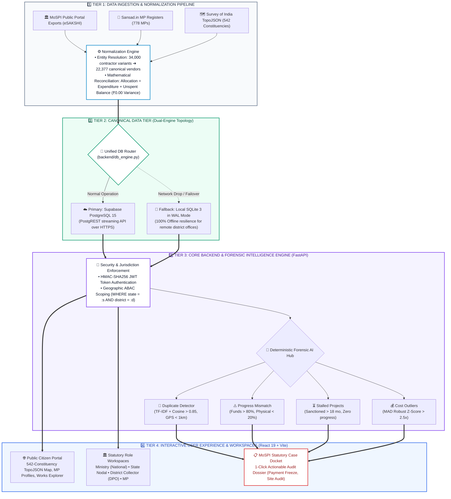
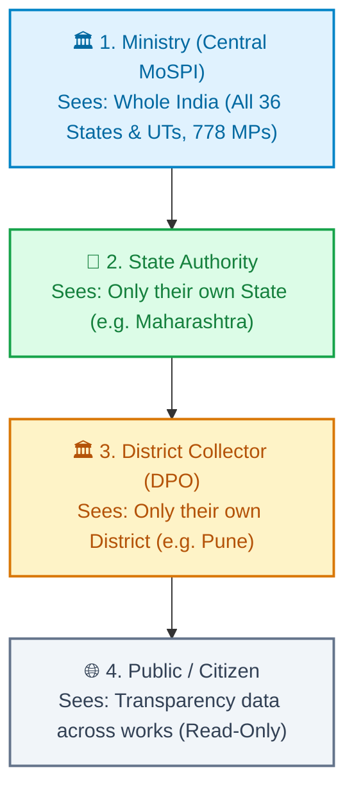
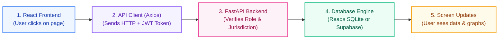
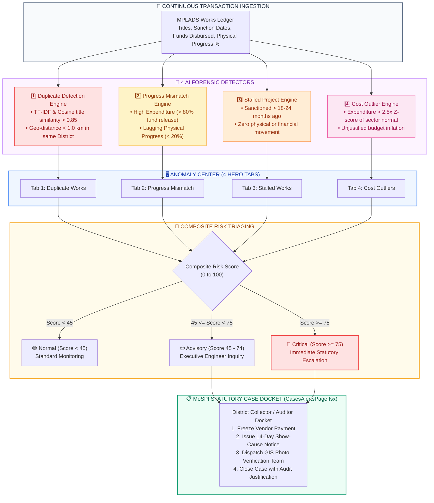
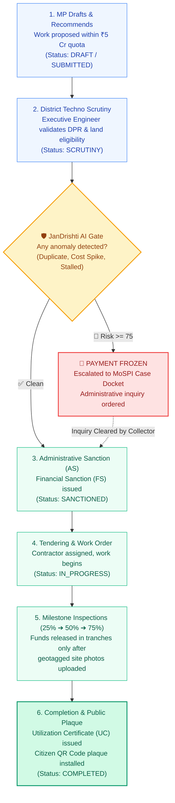
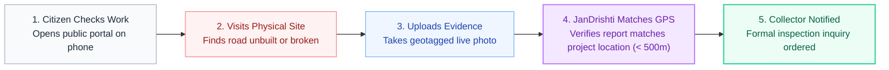

# JanDrishti — Simple & Explainable System Architecture & Flowcharts
> **Smart India Hackathon 2026 (SIH102 / SIH26102)**  
> **Topic:** AI-Powered MPLADS Parliamentary Intelligence & Public Fund Accountability  
> **Target Audience:** Evaluators, Jury Members, Team Presenters, and Developers  
> **Purpose:** 100% explainable blueprints with box-by-box breakdown, visual layout guides for drawing on paper/slides, and jury defense scripts.

---

## 🎯 Quick Navigation
1. [⭐ MASTER FLOWCHART: End-to-End System Process & Technical Methodology](#-master-flowchart-end-to-end-system-process--technical-methodology) *(The Core Architecture Chart on the Technical Dossier / Handwritten Page)*
2. [Flowchart 1: The 4 User Roles & Data Access (Who sees what?)](#flowchart-1-the-4-user-roles--data-access-who-sees-what)
3. [Flowchart 2: How the Code Works (Frontend to Database Request Lifecycle)](#flowchart-2-how-the-code-works-frontend-to-database-request-lifecycle)
4. [Flowchart 3: AI Anomaly Detection & Forensic Case Docket Pipeline (The 4 Hero Tabs)](#flowchart-3-ai-anomaly-detection--forensic-case-docket-pipeline-the-4-hero-tabs)
5. [Flowchart 4: Statutory Project Lifecycle & Pre-Disbursement Fund Gate](#flowchart-4-statutory-project-lifecycle--pre-disbursement-fund-gate)
6. [Flowchart 5: Cloud & Local Database Failover (Supabase ↔ SQLite 3)](#flowchart-5-cloud--local-database-failover-supabase--sqlite-3)
7. [Flowchart 6: How a Citizen Reports an Issue & Ground Photo Verification](#flowchart-6-how-a-citizen-reports-an-issue--ground-photo-verification)
8. [💡 Master Summary Table for SIH Presentation](#-master-summary-table-for-sih-presentation)

---

## ⭐ MASTER FLOWCHART: End-to-End System Process & Technical Methodology
*(This is the primary 4-tier methodology flowchart featured on Page 2 of the SIH Technical Dossier and drawn on handwritten presentation sheets).*

### 📌 In Simple Words
Think of JanDrishti as a high-speed water filtration plant for government money.  
1. **Dirty/Scattered Water Enters:** Raw, messy project files from government portals are ingested and cleaned (entity names resolved, duplicates merged).  
2. **Safe Storage Reservoirs:** Clean data is stored in dual databases (Cloud Supabase + Local offline SQLite).  
3. **AI Quality Testers:** 4 deterministic mathematical tests check for fraud, split bills, and stalled projects.  
4. **Clean Water Delivered:** The public and officials see pristine, role-tailored dashboards and 1-click audit dockets.

---

### 📊 Diagram (4-Tier Linear Methodology Pipeline)


---

### 📝 How to Draw this on a Page / Paper by Hand (Visual Guide)
When drawing this chart on paper, a notebook, or a presentation slide, follow this **4-Deck Stack**:

```
+-------------------------------------------------------------------------------+
|  TIER 1: DATA INGESTION & NORMALIZATION PIPELINE                             |
|  [eSAKSHI Portal] + [Sansad.in MPs] + [Survey of India TopoJSON]              |
|  --> [Normalization Engine: 34K contractors -> 22,377 canonical vendors]       |
+---------------------------------------+---------------------------------------+
                                        | (Clean Canonical Records)
                                        v
+-------------------------------------------------------------------------------+
|  TIER 2: CANONICAL DUAL-ENGINE STORAGE                                        |
|  [Unified DB Router]                                                          |
|    |--> [Primary: Supabase Cloud PostgreSQL]                                  |
|    +--> [Fallback: Local SQLite 3 WAL Mode] (100% Offline field resilience)    |
+---------------------------------------+---------------------------------------+
                                        | (Secured Query Access)
                                        v
+-------------------------------------------------------------------------------+
|  TIER 3: CORE BACKEND & FORENSIC INTELLIGENCE (FastAPI)                       |
|  [HMAC-SHA256 JWT Auth] + [Geographic ABAC Jurisdiction Scoping]              |
|  --> [4 Forensic Detectors: Duplicates | Progress Mismatch | Stalled | Cost]   |
+---------------------------------------+---------------------------------------+
                                        | (Alerts & Scoped Data)
                                        v
+-------------------------------------------------------------------------------+
|  TIER 4: REACT 19 FRONTEND & WORKSPACES                                       |
|  [Citizen Portal (542 Map)] | [Role Workspaces (MP/DM/State)] | [MoSPI Docket]  |
+-------------------------------------------------------------------------------+
```

---

### 🔍 Box-by-Box Technical Breakdown

| Tier & Box | What it Does in Simple Words | Technical Implementation & Formula | Codebase File Reference |
|---|---|---|---|
| **Tier 1: Ingestion** | Ingests scattered government records from 3 sovereign sources. | Python ETL extractors for eSAKSHI line items, MP profiles, and GeoJSON boundaries. | `backend/database.py`, `data/` |
| **Tier 1: Normalization** | Resolves typos and spelling variations across contractor names (e.g. "ABC Const" vs "ABC Construction Ltd"). | **Levenshtein Distance + Jaccard Token Clustering**: Clustered 34,000 raw messy strings into **22,377 canonical vendor entities**. Also enforces double-entry balance: $\text{Allocation} = \text{Expenditure} + \text{Unspent Balance}$. | `backend/intelligence.py` |
| **Tier 2: Dual Storage** | Cloud database with automatic offline local fallback. | Supabase PostgreSQL 15 as primary cloud; local SQLite 3 in WAL (Write-Ahead Logging) mode as fallback. Zero data loss if internet drops. | `backend/db_engine.py` |
| **Tier 3: Security & ABAC** | Ensures an official from District X cannot peek into District Y. | **Attribute-Based Access Control (ABAC)**: Server inspects JWT claims and automatically appends `WHERE state = :s AND district = :d` to all queries. | `backend/auth.py`, `backend/scope.py`, `backend/rbac_abac.py` |
| **Tier 3: 4 AI Detectors** | Runs 24/7 automated financial forensic checks. | **Deterministic Math**: (1) TF-IDF + Haversine distance, (2) Progress vs Spend delta, (3) Inactivity age, (4) Median Absolute Deviation (MAD) modified Z-score. | `backend/intelligence.py` |
| **Tier 4: Workspaces & UI** | Gives each user the right screen for their job. | React 19 + TypeScript + Vite + Tailwind CSS + D3-Geo for sub-second vector map rendering. | `frontend/src/pages/OverviewPage.tsx`, `frontend/src/pages/CasesAlertsPage.tsx` |

---

### 🎤 How to Explain to the Jury (60-Second Presentation Pitch)
> *"Judges, this is JanDrishti's End-to-End Methodology Flowchart. It operates in 4 clear tiers:*
> 
> *1. **Data Ingestion Tier:** We ingest 102,437 real works from MoSPI and Sansad.in. Our canonical entity-resolution engine normalized 34,000 messy contractor spellings into 22,377 unique corporate identities with mathematical reconciliation.*
> *2. **Dual-Engine Storage Tier:** For national oversight, we stream live from Supabase PostgreSQL. But if a District Collector is in a remote rural area without internet, the system automatically falls back to a local SQLite WAL database with zero downtime.*
> *3. **Core Backend & Forensics:** Our FastAPI engine enforces strict geographic ABAC security—so no official can access data outside their legal jurisdiction. Then, our 4 deterministic AI algorithms continuously scan for duplicates, progress mismatches, delays, and cost outliers.*
> *4. **Interactive Workspaces:** Finally, these insights feed into role-tailored React 19 dashboards and an actionable MoSPI Case Docket where Collectors can freeze payments with one click.*
> 
> *Everything is deterministic, auditable, and 100% compliant with official MoSPI guidelines."*

---

### 🛡️ Jury Defense Q&A (Tough Questions & Answers)
* **Q1: Why did you use deterministic statistical algorithms instead of deep learning or LLMs?**  
  *Answer:* *"In public financial auditing and statutory law, algorithmic decisions must be legally defensible in a court of law or CAG inquiry. Deep learning models are 'black boxes' prone to hallucination. Our formulas (Benford's Law, MAD Z-score, TF-IDF + GPS Haversine) produce 100% reproducible, explainable mathematical proof."*

* **Q2: What happens if an official tampers with the URL to view another district?**  
  *Answer:* *"We use Attribute-Based Access Control (ABAC) in `backend/scope.py`. The user's role and district are cryptographically sealed inside their HMAC-SHA256 JWT token. Even if an official changes `?district=Pune` to `?district=Mumbai` in the browser, the backend rejects the query with an immediate HTTP 403 Forbidden."*

* **Q3: What makes your dual-engine database failover unique?**  
  *Answer:* *"Unlike pure cloud systems that crash in remote tribal or rural districts with unstable internet, our `db_engine.py` acts as an intelligent circuit breaker. It detects network timeout in under 500ms and seamlessly switches to local SQLite without logging out the user or interrupting the workflow."*

---

## 1. The 4 User Roles & Data Access (Who sees what?)

### 📌 In Simple Words
JanDrishti divides users into **4 clear levels**. Higher levels see broader data, while field officers only see their own area so data remains organized and secure.

### 📊 Diagram


### 🚶 How it works in Code:
1. When a user logs in, their **Role**, **State**, and **District** are stored in the session (`RoleContext.tsx`).
2. When fetching data, the frontend automatically attaches `?state=...&district=...`.
3. The backend database automatically adds `WHERE state = ... AND district = ...`, so no official can tamper with or view another district's private cases.

### 🎤 How to Explain to the Jury:
> *"We designed a strict 4-tier governance hierarchy based on official MoSPI guidelines. Central Ministry sees macro national trends, State officials manage state-wide allocations, District Collectors take field actions in their own district, and Citizens have open transparency. Security is enforced at the database query level."*

---

## 2. How the Code Works (Frontend to Database Request Lifecycle)

### 📌 In Simple Words
When a user clicks on a button in the browser, here is the simple 5-step journey that fetches the data and displays it on the screen.

### 📊 Diagram


### 🚶 Step-by-Step Breakdown:
1. **User Action**: A user opens the Work Explorer or Anomaly Center on the website (`React 19 + TypeScript`).
2. **API Request**: The browser sends a clean REST request (e.g., `GET /api/works?state=Maharashtra&district=Pune`) via `client.ts` with Bearer JWT.
3. **Backend Routing & Security**: FastAPI receives the request, validates the token in `auth.py`, checks role permissions in `rbac_abac.py`, and scopes the query in `scope.py`.
4. **Database Query**: `db_engine.py` runs an optimized SQL query against Supabase PostgreSQL or local SQLite in sub-50ms.
5. **UI Rendering**: The JSON response updates the charts, tables, and metric cards with zero page reloads.

### 🎤 How to Explain to the Jury:
> *"Our architecture follows a decoupled micro-router pattern. The React 19 frontend communicates via structured REST APIs with our modular FastAPI backend, ensuring sub-50ms query response times and zero server blocking."*

---

## 3. AI Anomaly Detection & Forensic Case Docket Pipeline (The 4 Hero Tabs)

### 📌 In Simple Words
JanDrishti acts as an automated 24/7 financial detective. It scans all government project records, categorizes suspicious patterns into **4 distinct Hero Tabs**, scores the risk, and escalates serious flags directly to the District Collector's Case Docket for immediate action.

### 📊 Diagram (Full Ingestion to Statutory Triage)


### 🚶 The 4 Detection Rules & Mathematical Formulas:
1. **Duplicate Works (Tab 1):**  
   - Combines **TF-IDF + Cosine Similarity** on work descriptions with **Haversine GPS Distance**.  
   - If two works have text similarity $> 0.85$ and are within $1.0\text{ km}$ in the same district, it catches ghost contractors proposing the same road twice.
2. **Progress Mismatch (Tab 2):**  
   - Evaluates the discrepancy: $\Delta = (\% \text{ Funds Disbursed}) - (\% \text{ Physical Progress})$.  
   - If funds disbursed $> 80\%$ while physical progress $< 20\%$, it flags an immediate diversion warning.
3. **Stalled Projects (Tab 3):**  
   - Compares the sanction timestamp against current date.  
   - If age $> 18\text{ to }24\text{ months}$ with zero milestone advancement, it flags fund parking/stagnation.
4. **Cost Outliers (Tab 4):**  
   - Calculates robust **Median Absolute Deviation (MAD)** modified Z-scores per sector:
     $$\text{Modified } Z = \frac{0.6745 \times |X_i - \text{Median}|}{\text{MAD}}$$
   - Works with $Z > 2.5\times$ the district sector median are flagged for estimate inflation.

### 🏛️ Statutory Docket Lifecycle (`CasesAlertsPage.tsx`):
- Cases progress through auditable states: `NEW` ➔ `UNDER_REVIEW` ➔ `CLARIFICATION_REQUESTED` ➔ `DETAILED_REVIEW` ➔ `RESOLVED` / `ESCALATED`.
- Every review leaves an immutable record in `audit_logger.py` with the reviewing officer's ID, timestamp, and formal justification.

### 🎤 How to Explain to the Jury:
> *"Instead of waiting 5 years for a post-mortem CAG audit, JanDrishti detects financial corruption before final disbursement. We organize anomalies into 4 Hero Tabs: duplicates, progress mismatch, stalled projects, and cost outliers. If the composite risk score hits 75, the case is escalated to the District Collector's docket with an immediate payment-freeze recommendation."*

---

## 4. Statutory Project Lifecycle & Pre-Disbursement Fund Gate

### 📌 In Simple Words
How a public project moves from an MP's initial recommendation to final completion, showing how JanDrishti stops wrongful payments before funds leave the treasury.

### 📊 Diagram


### 🚶 The Key Stages:
1. **Recommendation**: MP suggests a school, road, or community hall within their ₹5 Cr annual limit.
2. **Techno-Economic Scrutiny**: District Executive Engineer verifies feasibility and ensures the work does not violate the MoSPI prohibited list.
3. **Pre-Disbursement Gate**: JanDrishti automatically checks whether duplicate GPS coordinates or cost spikes exist. If yes, payment is automatically blocked.
4. **Milestone Tranches**: Funds are disbursed in tranches (25%, 50%, 75%, 100%) only after geotagged photos verify physical ground progress.
5. **Final Closure & Public Plaque**: Utilization Certificate (UC) is issued, and a public plaque with a QR code is installed at the project site for citizen audit.

### 🎤 How to Explain to the Jury:
> *"Our system enforces a Zero-Trust Pre-Disbursement Gate. In traditional systems, money is released first and investigated years later. JanDrishti validates the work digitally before the money is transferred."*

---

## 5. Cloud & Local Database Failover (Supabase ↔ SQLite 3)

### 📌 In Simple Words
JanDrishti can run anywhere: in the cloud with Supabase, or completely offline on an edge laptop using SQLite.

### 📊 Diagram
```mermaid
flowchart TD
    App["JanDrishti Backend Engine (backend/db_engine.py)"] --> Check{"Is Cloud Database<br/>(Supabase PostgREST) reachable?"}
    
    Check -->|Yes (Online)| Cloud["☁️ Supabase Cloud (PostgreSQL 15)<br/>AWS Tokyo, live streaming, multi-user sync"]
    Check -->|No / Network Drop| Local["📁 Local SQLite 3 Database (WAL Mode)<br/>Instant fallback, sub-5ms local queries, 100% offline"]
    
    Cloud -.->|Automatic Circuit Breaker| Local
    Local -.->|Syncs back when reconnected| Cloud

    style App fill:#f1f5f9,stroke:#475569,stroke-width:2px,color:#1e293b
    style Check fill:#fef3c7,stroke:#d97706,stroke-width:2px,color:#92400e
    style Cloud fill:#dcfce7,stroke:#16a34a,stroke-width:2px,color:#15803d
    style Local fill:#ffedd5,stroke:#ea580c,stroke-width:2px,color:#9a3412
```

### 🚶 Why this matters:
* **In Hackathon / Local Testing**: Works instantly out of the box without needing internet or remote database logins (`database/mplads.db`).
* **In Production Cloud**: Seamlessly switches to Supabase PostgreSQL when credentials are provided in `.env`.
* **Zero Downtime**: If cloud connectivity is lost, the app gracefully falls back to local data.

### 🎤 How to Explain to the Jury:
> *"We implemented a hybrid storage architecture. For cloud deployment, JanDrishti connects to Supabase PostgreSQL. For field officers or remote areas with poor internet, it automatically falls back to an immutable local SQLite database without any code changes."*

---

## 6. How a Citizen Reports an Issue & Ground Photo Verification

### 📌 In Simple Words
Empowering ordinary citizens to act as the eyes and ears of governance by reporting substandard or fake works directly from their smartphones.

### 📊 Diagram


### 🚶 How it protects against fake complaints:
* When a citizen uploads a photo, the system extracts the **GPS latitude/longitude** from the image EXIF metadata.
* If the photo's GPS matches the actual project location within 500 meters, it is flagged as **Verified Ground Observation**.
* Clusters of complaints from the same area automatically elevate the case priority to **Critical**.

### 🎤 How to Explain to the Jury:
> *"JanDrishti bridges citizens and administration. Citizens can verify completed projects on a map, upload live geotagged photos if work is missing, and trigger an auditable inquiry directly on the District Collector's dashboard."*

---

## 💡 Master Summary Table for SIH Presentation

| Diagram / Feature | One-Liner Description | Key Metric / Tech | Codebase Anchor |
|---|---|---|---|
| **⭐ Master Flowchart** | 4-tier methodology pipeline from raw ingestion to citizen transparency | 102K works, 22K vendors, ₹0 variance | `JanDrishti_SIH26102_Technical_Approach_and_Feasibility.pdf` (Page 2) |
| **1. Roles Hierarchy** | 4-tier governance hierarchy with strict regional data scoping | Central MoSPI ➔ State ➔ District ➔ Citizen | `RoleContext.tsx`, `backend/scope.py` |
| **2. Codebase Flow** | React 19 ➔ Axios ➔ FastAPI ➔ Routers ➔ SQLite/Supabase | Sub-50ms query response time | `frontend/src/api/client.ts`, `backend/main.py` |
| **3. AI Hero Tabs** | 4 automatic detectors: Duplicates, Progress Mismatch, Stalled, Cost | TF-IDF, Haversine, MAD Z-Score | `backend/intelligence.py`, `CasesAlertsPage.tsx` |
| **4. Fund Lifecycle** | Pre-disbursement fraud check prevents corrupt fund release | Zero-Trust Financial Gate | `backend/workflow.py`, `backend/gov_service.py` |
| **5. Dual DB Failover** | Cloud Supabase with offline SQLite edge fallback | Dual-mode automatic circuit breaker | `backend/db_engine.py` |
| **6. Citizen Vigilance** | Geotagged civic photo verification triggers Collector inquiries | EXIF GPS matching within 500m | `frontend/src/pages/OverviewPage.tsx` |
