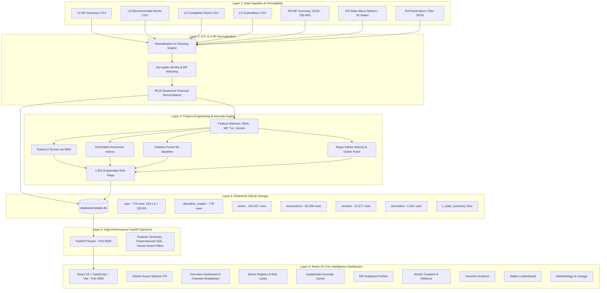
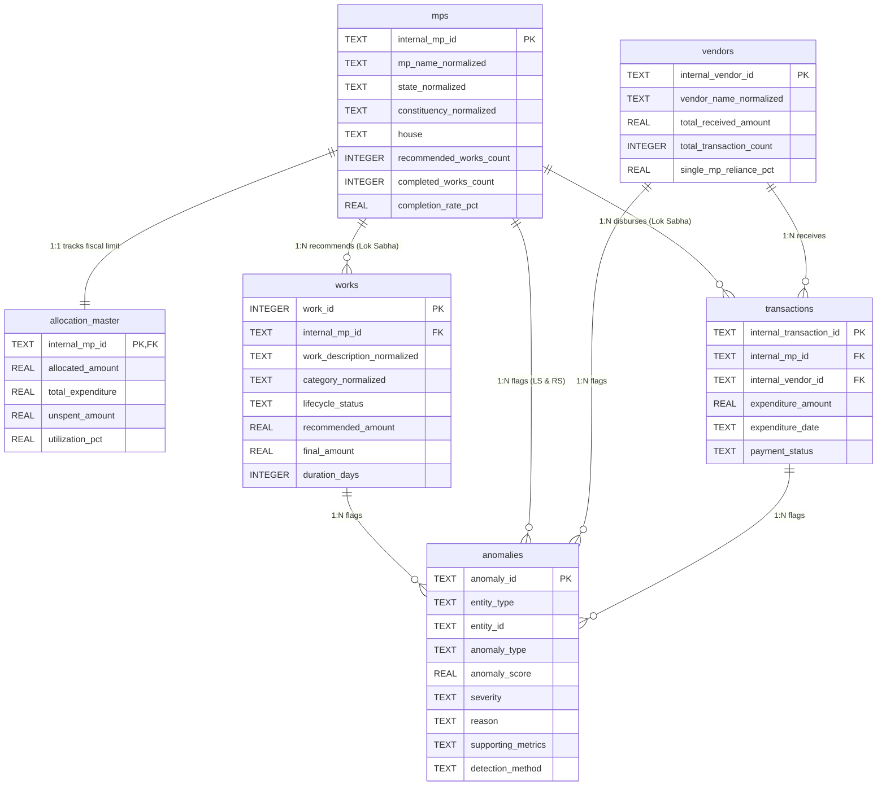

# SIH26102 — Final System Architecture & Technical Specification

**System Version:** `v1.1.0-FULL-PARLIAMENT`  
**Problem Statement:** SIH26102 (Trustworthy MPLADS Data Analytics & Anomaly Detection Platform)  
**Scope:** Full Bicameral Parliament (18th Lok Sabha & Rajya Sabha)  
**Architecture Classification:** 7-Tier Decoupled Data Engineering & Intelligence Stack  

---

## 1. End-to-End System Architecture

---

## 2. Relational Entity-Relationship Model (3-NF)

---

## 3. Bicameral Verification & Reconciliation Matrix

| Parameter | 18th Lok Sabha | Rajya Sabha | Combined Parliament | Official Source Totals | Reconciliation Variance |
| :--- | :--- | :--- | :--- | :--- | :--- |
| **Members (MPs)** | 543 | 235 | **778** | 778 | **0 (Exact)** |
| **Allocated Limits** | ₹83,06,21,04,294.53 | ₹33,61,33,47,899.82 | **₹1,16,67,54,52,194.35** | ₹1,16,67,54,52,194.35 | **₹0.00 (Exact)** |
| **Total Expenditure** | ₹27,19,13,90,292.45 | ₹12,28,32,01,022.69 | **₹39,47,45,91,315.14** | ₹39,47,45,91,315.14 | **₹0.00 (Exact)** |
| **Unspent Balance** | ₹55,87,07,14,002.08 | ₹21,33,01,46,877.13 | **₹77,20,08,60,879.21** | ₹77,20,08,60,879.21 | **₹0.00 (Exact)** |
| **National Utilization** | 32.74% | 36.54% | **33.83%** | 33.83% | **0.00% (Exact)** |
| **Recommended Works** | 68,872 | 24,656 | **93,528** | 93,528 | **0 (Exact)** |
| **Completed Works** | 33,746 | 9,855 | **43,601** | 43,601 | **0 (Exact)** |
| **National Completion** | 49.00% | 39.97% | **46.62%** | 46.62% | **0.00% (Exact)** |
| **Physical Works (Granular)** | 102,437 | Not in Export | **102,437 (LS Only)** | 102,437 | **0 (No Fabrication)** |
| **Payment Vouchers (Granular)** | 82,296 | Not in Export | **82,296 (LS Only)** | 82,296 | **0 (No Fabrication)** |
| **Vendors / Contractors (Granular)**| 22,377 | Not in Export | **22,377 (LS Only)** | 22,377 | **0 (No Fabrication)** |
| **Explainable Flags** | 1,804 | 27 | **1,831** | 1,831 | **100% Traceable** |

---

## 4. Mathematical Anomaly Detection Specifications

### A. Robust Z-Score via Median Absolute Deviation (MAD)
For continuous monetary spending variables:
$$Z_{\text{robust}} = \frac{0.6745 \times (x - \text{median})}{\text{MAD}}$$
$$\text{MAD} = \text{median}(|x - \text{median}|)$$

### B. Herfindahl-Hirschman Index (HHI) for Procurement Concentration
Measured against the **MP's total recorded expenditure**:
$$\text{HHI} = \sum_{i=1}^{k} \left( \frac{\text{Vendor\_Expenditure}_i}{\text{MP\_Total\_Recorded\_Expenditure}} \times 100 \right)^2$$

### C. Vendor Single-MP Dominance Scoring
For high-revenue contractors ($\ge \text{₹2 Crores}$):
$$S = \min\left(1.0, \, 0.65 + \left(\frac{\text{total\_received\_amount}}{100,000,000}\right) \times 0.10\right)$$

### D. Rajya Sabha Specific Fiscal Anomaly Indicators
1. **Low Utilization Outlier:** Allocated $\ge \text{₹5.00 Cr}$ AND Utilization $< 5.0\%$ ($Z_{\text{robust}} \le -1.5$).
2. **High Allocation Outlier:** Allocated Limit $> \text{₹25.00 Cr}$ ($Z_{\text{robust}} \ge 3.0$).
3. **Calamity Transfer Outlier:** Consent Contribution Amount $\ge \text{₹1.00 Cr}$.

---

## 5. Ethical & Governance Directives

1. **Non-Accusatory Classification:** The platform evaluates statistical divergence from empirical peer baselines. It flags patterns that *require administrative review*, never asserting illegality or fraud.
2. **Missing Source Transparency:** Unobserved parameters (`latitude`, `longitude`, `sanctioned_amount`, `work_contractor`) are strictly preserved as `null` and displayed as *"Not available in current source export"*.
3. **Cartesian Safety:** Expenditure vouchers connect to MPs and Vendors without artificial, unverified linkages to individual physical work items.
4. **House Integrity:** Lok Sabha maintains territorial constituency semantics; Rajya Sabha maintains official State/UT representation and nominated categories without fake constituency mapping.
